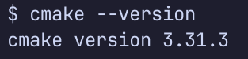
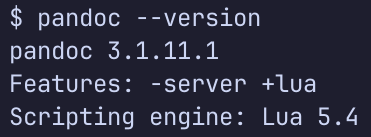
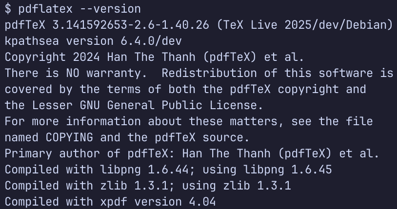
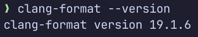
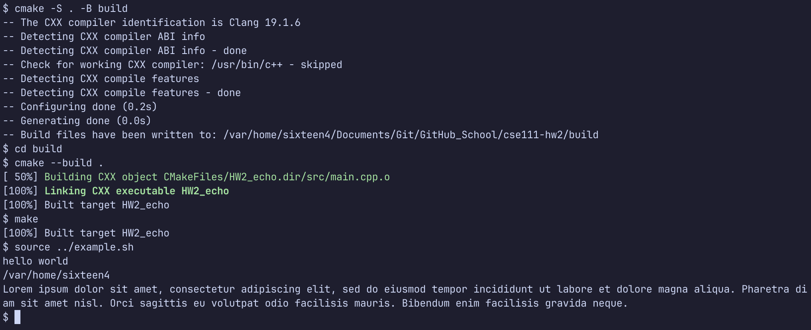
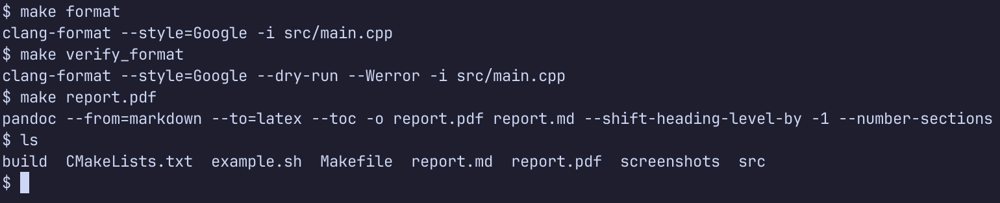

# HW2 Report

Peter Dobbins

## Tools Installed









## C++ Source Files

```cpp
#include <iostream>

int main(int argc, char *argv[]) {
  for (int i = 1;; i++) {
    std::cout << argv[i];

    if (i + 1 >= argc) break;

    std::cout << " ";
  }

  std::cout << std::endl;

  return 0;
}
```

## Compiling



## Custom Makefile

```makefile
SOURCES = src/main.cpp

format:
	clang-format --style=Google -i ${SOURCES}

verify_format:
	clang-format --style=Google --dry-run --Werror -i ${SOURCES}

report.pdf: report.md
	pandoc --from=markdown --to=latex --toc -o $@ $^ --shift-heading-level-by -1 --number-sections
```


